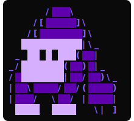

# koko 🦍💻




![original.flipster](https://img.shields.io/badge/-original.flipster-grey?logo=data%3Aimage%2Fgif%3Bbase64%2CR0lGODlhQABIAIQRACAo+wAAACklJFExblwglP+LFn0sEqMixlBIReIqAJ6Oif/FFv+LFv+LFv//AP/FFv///ymYGimYGimYGimYGimYGimYGimYGimYGimYGimYGimYGimYGimYGimYGimYGiH+EUNyZWF0ZWQgd2l0aCBHSU1QACH5BAEKAB8ALAAAAABAAEgAAAX+4CeOZGmeH0GgX8K+8NuQs0kkeFzHfHyvItwt8RvdeshkC0gkNAKBREOaOiqvMFXjCVUIoIGtCqvcfWZWJ1cBUSAQgji0MW6JdlTsdgvjQv4Qb3BxcnwoK3tAPFNgToqIW1B/gpSDcmEudimRYHQ9dAEPD1BSNZyTlamEX0N3BGAMDGGKfa8PBg+yc1wIgW8KbpSEb6udTwYMorGzn68MA7EGBlFEAai9qnHEhGA4AbixA6NTzQEMB9CxuoCp7dlfUOoDAweynovO9PSybb6+26tWVdJm7hk9dPZoyXCGDt23a4LggZkIRYAwOAqg6DtQD9OnBOY4HrAGEQ4sdSj+lwXQNjAAx33MeNz4po/NP24oRenUqa5iqgAH50VZFMTWyH8m4yXbyZTnsmHEgHKkdudFDinmBrCJ+A1ZrKZgczGYtpKSF6FTcGRi4YIRP2EFv4YFG80nsYwDZuXIokXSzbhzA4uVZTHqFzp12KpQY21bQcGQexY2iVjF3hJpvPmCJxdyZMJ3ZwFJHGTtkABRvXpeLbYs5cRESFwG2Zii7ds6b+ueiICaotgj1BJ5gm238WVkjVM02aQF8NKIibshCeaPJOUQ/GrXTbnJFFo4vkvvTTI79fO3rZ9/oH754cXfSWiZMh4eoO3tleI3jx7MG0xSNFfVJpFEpct56qn+h4wy+1Vn3lhlhbFFbJdVUQpqJqmEoHkQTLMUgxtyWBBZve3xnCYiMIbaF8kklyB/H/K0H39iTVOiGLJhRh9qKyVTF4LxhLUOf7DkggyPEipkhBZY9SbAhxpOJJgsUS442IpRIIbZYk40KYCVIFIE2W1yjSULc5VxqeaO/3U2mDo6HSTSALgok5JT01iUZZqLqaUGVjyCKZhUdIYSGYnG0PGdZRM2+gp5ydjmpihAAdUUbgcyV0qAXJqYFi+AyWgoU6MyVedOT1Em4aadehoeht9ACMZcpeqEzDTJgVbipiaqecMe30FBnldfyXIpFKfmVmdPWGJC36KjwQesl/H+eBWkqdeiamhdl4hXCpdLqjFhGMImZSaclH6Ty6x2QjhKF52UkkgdNXjHhQPklvVFcnGF2hOzsUa40hcLSKilbHw4QVLBEn6BQEZkpoSSbtOtBMYCBSR5xl6ZKAyBAwwzLEBGhSnFr26SRQUMFBkHsADD9wQHnzUFO2CzyF4UxqI60pAlMWhfjGxxARhnB0HBlYUbCQQZ31xw0DmXHMrPcJarJ8krEQ1yAFuLUYe0XBe8gAMtWywHS18EhuEgAwfNMtFcZ+x1tIzZHEDZ+FKEdq2kRnTJRC1rvctiKc7nsgPZjY14xklVJPWxjoEhxx8305ylgIUrXEABiINhc3b+ggQA8WTmpBs5yXp+XLbqSZJm4SuHfwzFy6APArF/5sA6kRfBWJM350cXzCkLQ3DBct4L1I7RdeTxyJ8Xoctu90SJvPDDEwXLPrvyy2cnh0neQx/V0bN3LjfmJzAZO9f4co6hzmxMZJ/ok/0H8tZGI0249b8ezjWR/iGGeeDxBe/9B3AFkF3y9Lc/4qlPbKwDRO2ssRKIZWSCEtyc5dwnhQbyT2Fk41zeQEY754FhZRTszcde9rKF3Q1fSevBzDA2NqZNJHnXqR8Ffccwv5DtZQVAHxL6wrLk2Q1fODRg9KCwtd4g7mhl6yAZpEUbIJLtbkdT4n/yhxqxbc1grruPQp9c1rT2uayHt/kiatrHQCVhgYg4LGPGkidByt3NcliE4YnIoCPs2W1sTGShIN3HusoljI/EwwrR5qg93dgMXz+UECIXcTdAAu9jkGwf5QrGuRaaYZIyeNvsWMi+M2LMNp8EpQyAdbeyUURuwEqlKj9xuCdiEmmynGUZjMfClhlCl5NkZaKAOctYAguYIQAAOw==&logoSize=auto&labelColor=grey&color=292524)

A security- and privacy-first sandboxed coding assistant for the terminal. `koko` connects to all of your favorite LLM providers and provides least privilege access to your files and the shell. Nothing that you don't want to is leaving your machine. Worry-free agentic coding.

## Features

### Multi-Provider LLM Support

koko supports three LLM backends:

- **Claude** — Claude models via the Anthropic API (`CLAUDE_API_KEY`)
- **Mistral** — Mistral models via the Mistral API or any compatible endpoint (`MISTRAL_API_KEY`)
- **Ollama** — Local models with no API key required (default: `http://localhost:11434`)

Switch the active model at runtime with `:model <name>` or set defaults in `~/.koko/config.toml`.

**Always-on efficiency:** Claude requests carry `cache_control` breakpoints on the tools, system prompt, and growing conversation prefix, so the cached prefix costs ~10% of normal input tokens and skips recompute (5-minute auto-refreshing TTL). Ollama requests keep the model resident for 30 minutes so its KV prefix cache survives between turns. Output-token accounting is corrected for Claude, and a `truncated` hint is shown when a response stops at the max-token limit.

**Mistral — `conversations`** (default `true`; set `conversations = false` to opt out): uses Mistral's server-side Conversations API (`/v1/conversations`) so only the new turn is sent each request instead of the full history. koko tracks the `conversation_id` and self-heals (re-creates the conversation) whenever the local history is rewritten by `:clear`, `:compact`, `:resume`, or auto-trim. **Note:** this stores your conversation on Mistral's servers — a trade-off against koko's local-first stance, which is why it can be disabled. Tool-call round-trips and image inputs over the Conversations API are not yet validated against a live key.

### Sandbox

The sandbox is the core security boundary. Every file operation is validated against it before execution.

- **Directory allowlist** — the agent can only read, write, or list inside explicitly allowed directories. Default is the current working directory; additional dirs can be configured.
- **Symlink-safe path resolution** — paths are canonicalized through symlinks before validation. Final-component opens use `O_NOFOLLOW` to prevent TOCTOU swaps.
- **Typed validation token** — paths must pass `ValidatePath` (which returns a typed `ValidPath`) before reaching any I/O method. The compiler enforces "no raw paths in editor."
- **Denied file patterns** — sensitive files are blocked by glob regardless of directory. Defaults:
  - `.env`, `.env.*`
  - `*.pem`, `*.key`, `id_rsa*`
  - `credentials.json`
  - `*.secret`, `*.password`
- **File size limit** — reads/writes capped at a configurable maximum (default: 1 MB).

### Elevated-Privilege Guard

If koko is launched by a user with root privileges (effective UID 0), it prints a warning that running a non-deterministic agent with elevated privileges is strongly discouraged and requires explicit `y` confirmation before starting. Declining aborts the launch. The check is on by default; opt out by setting `suppress_elevated_warning = true` under `[sandbox]` in `~/.koko/config.toml`.

### Command Policy

Shell commands run through `exec_command` are gated by a regex-based policy:

- **Default deny list** covers privilege escalation (`sudo`, `su`), remote network (`ssh`, `scp`, `nc`, `telnet`), shell evaluation (`eval`, `source`, backticks, `$(…)`), pipe-to-shell (`curl|sh`, `wget|sh`), and other classic footguns.
- **Optional allowlist** — when set, the first token of every command must appear in the list. Deny patterns take precedence.
- **User confirmation** — every `exec_command` invocation prompts for explicit approval before running.
- **Exec hardening** — commands run with `ulimit` caps on CPU seconds, memory, and output file size. Stdout/stderr are bounded.

### Agent Tools

The agent has 12 tools, all mediated through the sandbox:

**Files**

| Tool | Description |
|------|-------------|
| `read_file` | Read file contents with optional line offset/limit |
| `write_file` | Create a new file (refuses to overwrite unless `overwrite=true`) |
| `replace_in_file` | Find-and-replace requiring a unique match |
| `rename_file` | Move or rename a file |
| `delete_file` | Remove a file (supports `/undo`) |
| `list_dir` | List directory contents with optional recursive tree |
| `search_files` | Pattern search across files with context lines |

**Shell**

| Tool | Description |
|------|-------------|
| `exec_command` | Run a shell command (policy-gated, requires user confirmation) |

**Memory**

| Tool | Description |
|------|-------------|
| `save_memory` | Save a persistent memory across sessions |
| `delete_memory` | Remove a stored memory |
| `list_memories` | List all stored memories with bodies |

**Planning**

| Tool | Description |
|------|-------------|
| `exit_plan_mode` | Present a plan for user approval (only callable in plan mode) |

### Privacy & Redaction

Two layers of automatic redaction:

- **Secrets** — scans for and redacts known token formats: AWS keys, GitHub PATs (`ghp_`/`gho_`/`ghu_`/`ghr_`/`ghs_`), Google API keys, Slack tokens, Stripe keys, OpenAI/Anthropic keys, JWTs, PEM private key headers, and assignment-style secrets (`API_KEY=...`).
- **PII** — emails, US SSNs, NANP-format US phone numbers, Luhn-verified credit cards, and public IPv4 addresses (loopback / RFC1918 / link-local are excluded).

Redaction runs on the outbound message stream to the LLM (when `scrub_pii=true`, the default) and on session writes to disk. `write_file` and `replace_in_file` also run a secret scan on their new content.

**Remote-provider warning** — when the active provider is anything other than Ollama (i.e. Claude or Mistral, which send data to a remote service), koko shows a privacy warning on startup noting that data may be retained by the provider and recommending Ollama for fully local inference. Ollama runs entirely locally and triggers no warning.

### Project Detection

koko scans the sandbox root for marker files (`go.mod`, `package.json`, `Cargo.toml`, `pyproject.toml`, `Dockerfile`, etc.) and surfaces the result both in the splash banner and as part of the LLM system prompt for orientation.

### Audit Logging

Every tool invocation is recorded to `~/.koko/audit.jsonl` with timestamp, tool name, arguments, result, and a SHA-256 hash chained to the previous entry. The chain is verified at startup — broken or missing hashes fail loudly.

### Memory

Persistent cross-session memories live at `~/.koko/memory/`. The agent can save (`save_memory`) and delete (`delete_memory`) typed entries (user / feedback / project / reference) that surface as context in future sessions.

### Plays

Markdown files in `~/.koko/plays/` register as named playbooks. The play name is the filename without `.md` — `review.md` is invoked as `:review`. `:plays` lists installed plays.

**Arguments** — text typed after the play name is passed in. If the play body contains a `{{args}}` placeholder, the argument is substituted in place; otherwise it is appended under a `User request:` heading. Example: `:review focus on auth` runs `review.md` with `focus on auth` as the argument.

### Config Reload

`:reload` re-reads configuration from its sources (config file, then environment, then the original launch flags — same precedence as startup) without leaving the session. Changes that can be applied live are applied immediately and reported under `applied`: the model (when the provider is unchanged), the thinking verbs, and the session token budget. Changes that require a fresh process — provider, API URL, sandbox root/dirs/limits, `scrub_pii`, exec profile, ignore mode — are detected and listed under `restart` rather than silently ignored. If the reloaded config is invalid, the current config is kept and the error is reported.

### Caging the Agent

`:cage <username> [dir=PATH] [group=NAME] [os=darwin|linux]` generates a shell script that provisions a dedicated low-privilege user to run your coding CLI under, following the [caging-the-agent](https://originalflipster.com/playbooks/caging-the-agent/) playbook. It detects the OS and emits the matching variant (`dscl` on macOS, `useradd`/`groupadd` on Linux), creates a shared group and a `2770` workspace, and embeds a freshly generated random password. The script is written to your given path or `~/.koko/cage-<username>.sh` by default (mode `0700`). It's **never executed** until you run it `sudo sh <path>` yourself.

Optional parameters (`key=value`, any order):

- `dir=PATH` — where to write the script (default `~/.koko`; relative paths resolve against the sandbox root).
- `group=NAME` — the shared group to create and add both users to (default `collabo`).
- `os=darwin|linux` — override OS detection to generate a script for the other platform.

### Plan Mode

Toggle with `:plan` to switch into a read-only investigation mode. Write tools are disabled until the agent proposes a plan via `exit_plan_mode` and you approve it.

### Command Highlighting

As you type, koko recognizes when the current line is a known command or installed play (e.g. `:help`, `:review`). When it matches, the input caret turns green and the recognized name is echoed beside the prompt — live feedback that the command will run before you press enter.

### Interactive REPL

| Command | Description |
|---------|-------------|
| `:help` | Show available commands |
| `:koko` | Print the koko mascot |
| `:clear` | Reset conversation history |
| `:history` | Show message count |
| `:tokens` | Show token usage stats |
| `:undo` | Revert the last file change |
| `:run <cmd>` | Run a shell command directly (bypasses agent) |
| `:compact` | Summarize history to reclaim context |
| `:model [name]` | Show or switch the active model |
| `:config` | Display the active configuration |
| `:save` | Save the current session to disk |
| `:resume` | Restore a saved session |
| `:reload` | Reload config from its sources without restarting |
| `:plays` | List installed plays |
| `:cage <username> [dir=…] [group=…] [os=…]` | Generate a low-privilege user setup script |
| `:plan` | Toggle plan mode |
| `:<play>` | Run a named play (e.g., `:review`) |

Sessions are auto-saved when the agent finishes a turn.

## Installation

**One-liner (macOS / Linux, amd64 / arm64):**

```
curl -fsSL https://raw.githubusercontent.com/original-flipster69/koko/main/install.sh | sh
```

The script downloads the latest GitHub release matching your platform, verifies its SHA-256 checksum against `checksums.txt`, and installs the binary to `/usr/local/bin/koko` (uses `sudo` if the directory isn't writable).

Override the install location with `KOKO_INSTALL_DIR`, or pin a version with `KOKO_VERSION`:

```
KOKO_INSTALL_DIR=$HOME/.local/bin sh install.sh
KOKO_VERSION=v0.1.0 sh install.sh
```

**Via Go:**

```
go install github.com/original-flipster69/koko@latest
```

## Building from Source

```
./build.sh
```

The build script runs `go build -buildvcs=false` and (if `goda` is on `PATH`) regenerates `docs/deps.svg`.

## Usage

```
koko [flags]
```

| Flag | Description | Default |
|------|-------------|---------|
| `-provider` | LLM provider: `Claude`, `mistral`, `ollama` | `mistral` |
| `-model` | Model name | `mistral-large-latest` |
| `-llm-url` | API URL (for local or custom endpoints) | Provider default |
| `-sandbox` | Sandbox root directory | Current working directory |
| `-config` | Config file path | `~/.koko/config.toml` |

## Configuration

koko reads configuration from `~/.koko/config.toml`:

```toml
[llm]
provider = "Claude"
model = "claude-sonnet-4-20250514"
url = ""
max_tokens = 16384
max_session_tokens = 1000000
conversations = true     # Mistral: server-side conversation state; set false to opt out (see below)

[sandbox]
root = "/home/user/projects"
additional_dirs = []
deny_files = [".env", ".env.*", "*.pem", "*.key", "id_rsa*", "credentials.json", "*.secret", "*.password"]
max_file_size = 1048576
scrub_pii = true
suppress_elevated_warning = false   # set true to skip the root/elevated-privilege startup check

[sandbox.exec]
profile = "default"
allow = []
deny = []

[ignore]
mode = "gitignore"
files = []

[style]
thinking_verbs = ["thinking", "pondering", "scheming"]

# Optional color overrides, keyed by semantic role (not pigment). Each value is
# an ANSI 256-color code (0-255); any role omitted keeps koko's default.
[style.color_scheme]
# Roles: primary (headings/prompt/spinner/diff-frame/mascot outline), secondary
# (confirm/tool-tag/sub-headings), highlight (tool output + emphasis + mascot
# highlights), accent (mascot body), label, value, muted, error, success, code,
# diff_add_fg, diff_add_bg, diff_del_fg, diff_del_bg, diff_gutter, splash
error = 160
primary = 27
```

API keys come from environment variables:

- `CLAUDE_API_KEY` for Claude
- `MISTRAL_API_KEY` for Mistral
- Ollama requires no key

Command-line flags override config values; environment variables fill in only what's still empty after config + flags.

## Data Directory

koko stores runtime data in `~/.koko/`:

| Path | Purpose |
|------|---------|
| `config.toml` | User configuration |
| `audit.jsonl` | Hash-chained tool invocation log |
| `koko.log` | Application log (JSON format) |
| `session.json` | Saved conversation history (redacted) |
| `memory/` | Persistent cross-session memories |
| `plays/` | Markdown playbooks invokable as `:<name>` |
